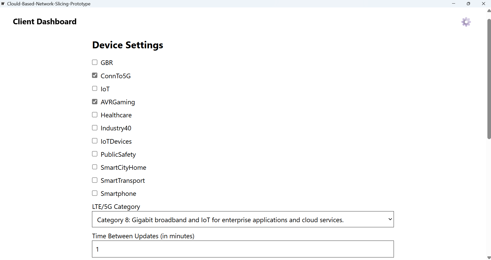
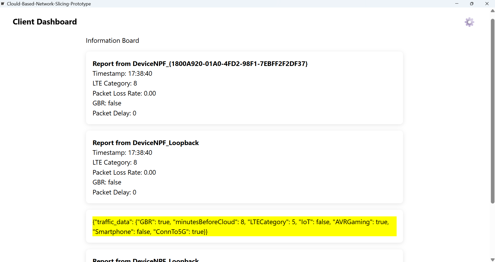
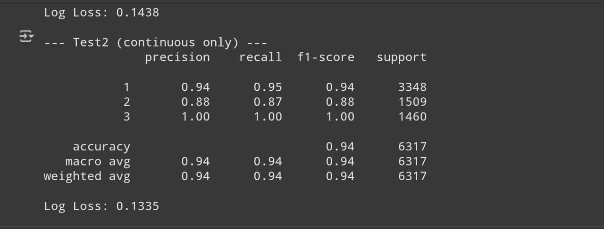
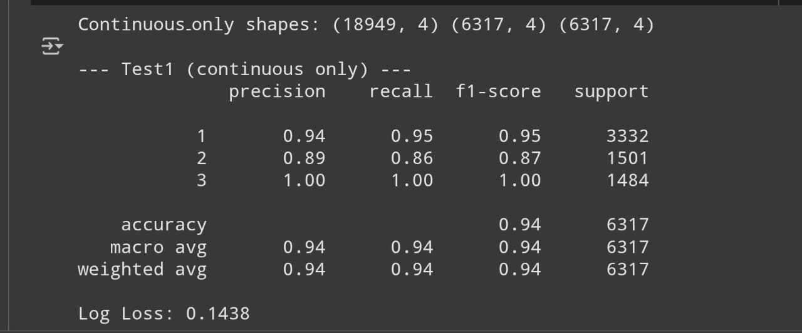
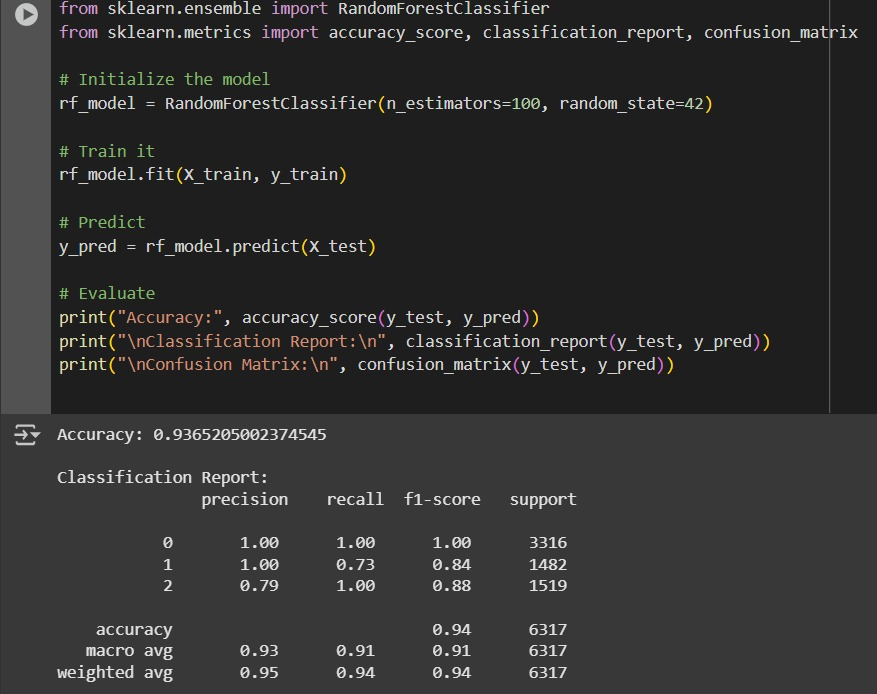
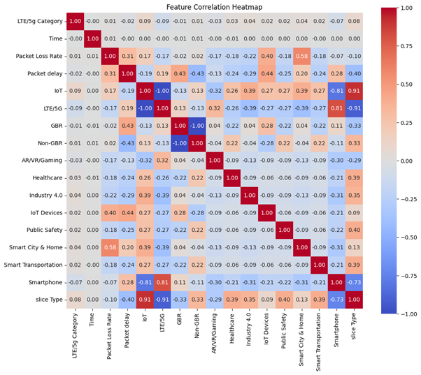

# 🛰️ Network Slicing in 5G Using Cloud and Machine Learning

> This project has been submitted for [AWS Presents: Breaking Barriers Virtual Challenge](https://aws-breaking-barriers.devpost.com/).

## Abstract
Welcome to our project repository! This project demonstrates a **prototype implementation of network slicing in 5G networks** using the power of **cloud computing** and **machine learning (ML)**. Our solution combines a **desktop client** written in Golang, **AWS Lambda functions**, and a **scikit-learn-based ML model** whose results are deployed on an **AWS S3 Bucket**.

---
## 📖 Table of Contents
- [Abstract](#abstract)
- [Table of Contents](#table-of-contents)
- [Images](#images)
- [What is 5G and Network Slicing?](#-what-is-5g-and-network-slicing)
- [Project Overview](#-project-overview)
- [How Machine Learning is used?](#-how-machine-learning-is-used)
- [Prototype Arcitecture](#-prototype-architecture)
- [Getting Started](#-getting-started)
- [License](#license)
- [Project Structure](#project-structure)
- [Team Members](#team-members)
---
## Images
<table>
  <tr>
    <td></td>
    <td></td>
  </tr>
  <tr>
    <td></td>
    <td></td>
  </tr>
  <tr>
    <td></td>
    <td></td>
  </tr>
</table>

---

## 📡 What is 5G and Network Slicing?

**5G** represents the fifth generation of mobile networks, offering faster speeds, ultra-low latency, and massive connectivity.  
**Network slicing** is a key feature of 5G that allows a single physical network to be partitioned into multiple virtual networks (slices), each tailored for a specific use case (e.g., autonomous vehicles, smart cities, or mobile broadband). This ensures **optimized resource allocation**, **performance isolation**, and **customizability** per slice.

---

## 🧠 Project Overview

Our prototype includes:

- **Golang Desktop Client**:  
  - Provides an interactive GUI using [Wails](https://wails.io/) library.
  - Captures relevant **network parameters** from the user's system.  
  - Provides user configurability for experience customization.  
  - Cross-platform and **device-agnostic** across most desktop systems.

- **Cloud-Hosted ML Model**:  
  - Network data is sent to an **AWS Lambda Function**.  
  - The function leverages tried and tested model parameters stored in an **AWS S3 Bucket** in form of a **Python-compatible binary file**.
  - The overhead of invoking services like Sagemaker is eliminated making the solution much more lightweight and efficient.
  - The model predicts and returns the appropriate **network slice number**.

- **Networking Estimation Techniques**:  
  - Parameters like **Packet Delay** are estimated using traditional techniques like **Round-Trip Time (RTT)**.

---

## 🤖 How Machine Learning is Used

We use **supervised learning**, a branch of ML where a model learns to map input features to outputs based on labeled training data. 

There are two things that exist primarily - regression and classification in the domain of supervised learning. Our model is **classification** and more specifically multiclass classification since we are dealing with multiple inputs. Also it is a **univariate**, because we are classifying only single values. **Slices {1,2,3}**

Similar to how for regression the performance measure is **RMSE**, the performance measure for classification: **accuracy, precision, recall, confusion matrix, f1 score** (in case precision and recall are similar it is most useful), **log loss, cross entropy**.

>A much more detailed report is available [here](./model/README.md)

Our classification model has been trained using public datasets, notably:
- [Network Slicing in 5G – Kaggle Dataset](https://www.kaggle.com/datasets/amohankumar/network-slicing-in-5g)

This trained model is capable of accurately categorizing network types and suggesting the correct slice for optimal performance.

> ✅ **Model Accuracy**: Upto **`97%`** on the testing dataset.

---

## 🧪 Prototype Architecture


---

## 🚀 Getting Started

To get started with our project, follow these steps:

1. If you are a developer your system must have [Golang](https://golang.org/doc/install) and [NodeJS](https://nodejs.org/en/download) installed.

2. Follow the [Wails Download Guide](https://wails.io/docs/2.0.0/getting-started/installation) to install Wails on your system.

3. Clone the repository:
   ```bash
   git clone https://github.com/Aman-Dabral/Clould-Based-Network-Slicing-Prototype.git
   ```

4. Install dependencies:
   ```bash
   cd network-slicing-prototype
   go mod tidy
   ```

5. Build the desktop client:
    ```
    wails dev
    ```
> **Note**: Wails 2.0 is yet to support linux.  

> **Note**: This repository even contains executable files for **Windows**. [Application](./build/bin/Clould-Based-Network-Slicing-Prototype.exe) and [Installer (for amd64)](./build/bin/Clould-Based-Network-Slicing-Prototype-amd64-installer.exe)
---

## License
This project is licensed under the MIT License.

---
## Project Structure
The Classic Wails Folder structure has been followed.
 - Lambda folder contains Python code for the lambda function we used.
 - Model are present in [Collab Notebook](). A comprehensive report is available in `model` directory. 
 - `frontend` folder contains the code for the frontend of desktop client. It is written in [Svelte](https://svelte.dev/) and [TailwindCSS](https://tailwindcss.com/).
 - `main.go` is the entry point of application.

## Team Members

- [Aman Dabral](https://github.com/Aman-Dabral)
- [Heymun Pareek](https://github.com/PareekHeymun)
- [Anshuman](https://github.com/Anshuman2040)

---